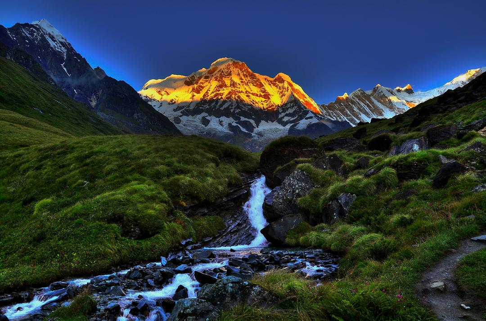
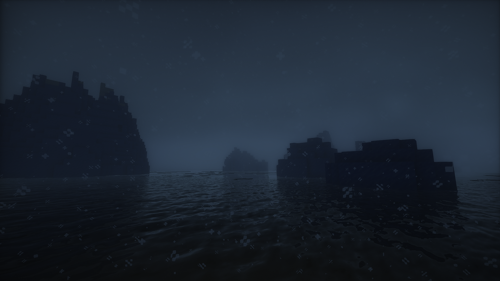
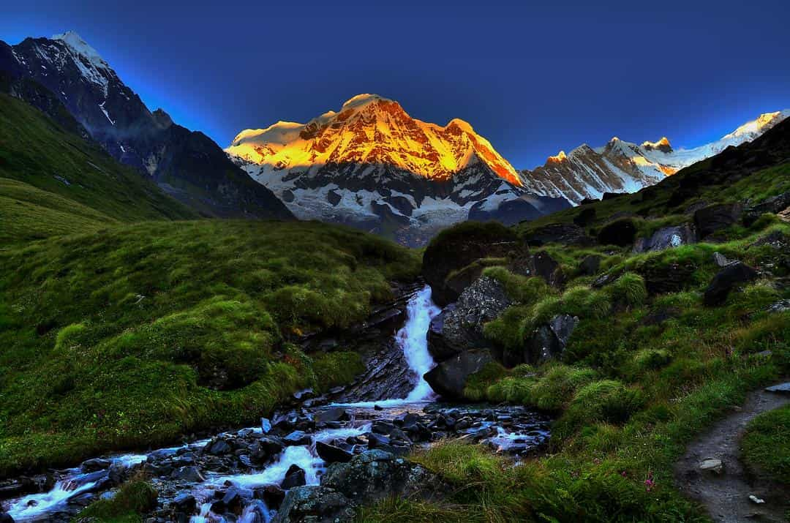
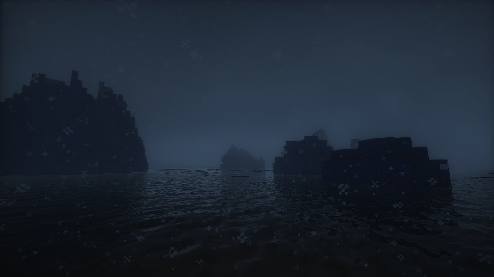
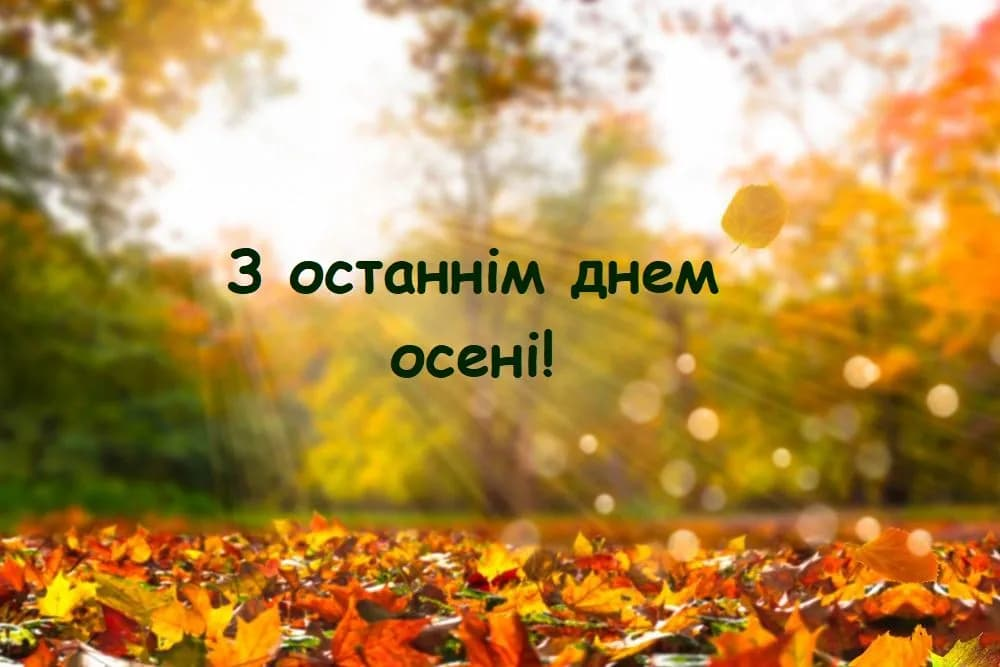
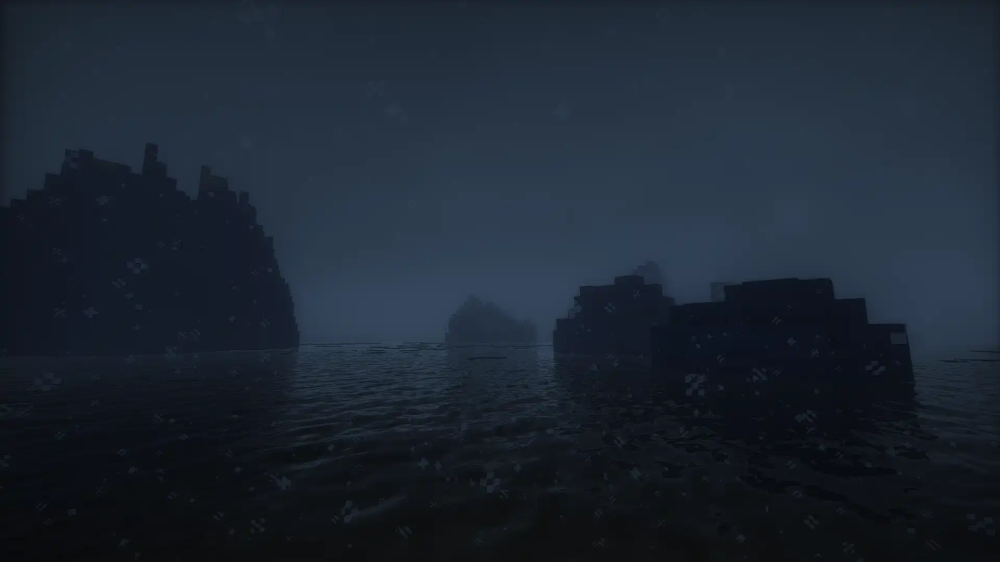
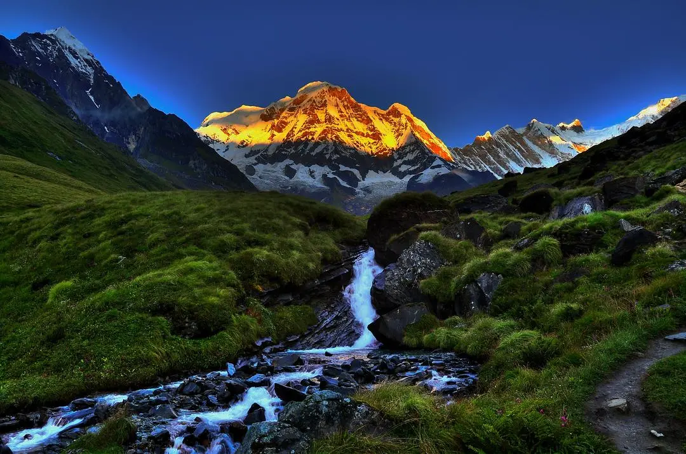
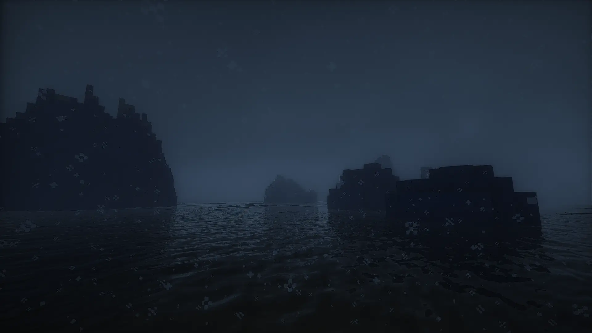

# Звіт з практичної роботи №1

### Оригінальні зображення

#### фото

#### скріншот

#### зображення з текстом

| **Параметр**            | **Фото**  | **Скріншот** | **Зображення з текстом** |
|-------------------------|-----------|--------------|--------------------------|
| **Вага**                | 149 MB    | 2.11 MB      | 57.4 KB                  |
| **Розширення**          | .jpg      | .png         | .jpg                     |
| **Роздільна здатність** | 1080x715  | 1920x1080    | 1000x667                 |

---

### Lossless 

#### Формат PNG

| **Параметр**            | **Файл 1** | **Файл 2** | **Файл 3** |
|-------------------------|------------|------------|------------|
| **Вага**                | 1.37 MB   | 2.06 MB    | 0.99 MB    |
| **Розширення**          | .png      | .png       | .png       |

#### Формат WEBP (lossless)

| **Параметр**            | **Файл 1** | **Файл 2** | **Файл 3** |
|-------------------------|------------|------------|------------|
| **Вага**                | 150 KB    | 1.15 MB    | 588 KB     |
| **Розширення**          | .webp     | .webp     | .webp     |

---

### Lossy 

#### MozJPEG Lossy 

| **Параметр / Якість** | **Файл 1** | **Файл 2** | **Файл 3** |
|-----------------------|------------|------------|------------|
| **Розширення**        | .jpg      | .jpg      | .jpg      |
| **50% - Вага**        | 73 KB     | 23 KB     | 42 KB     |
| **75% - Вага**        | 132 KB    | 44 KB     | 64 KB     |
| **100% - Вага**       | 572 KB    | 884 KB    | 481 KB    |

#### WEBP Lossy 

| **Параметр / Якість** | **Файл 1** | **Файл 2** | **Файл 3** |
|-----------------------|------------|------------|------------|
| **Розширення**        | .webp     | .webp     | .webp     |
| **50% - Вага**        | 100 KB    | 24 KB     | 40 KB     |
| **75% - Вага**        | 132 KB    | 36 KB     | 52 KB     |
| **100% - Вага**       | 368 KB    | 232 KB    | 148 KB    |

#### AVIF Lossy 

| **Параметр / Якість** | **Файл 1** | **Файл 2** | **Файл 3** |
|-----------------------|------------|------------|------------|
| **Розширення**        | .avif     | .avif     | .avif     |
| **50% - Вага**        | 96 KB     | 20 KB     | 28 KB     |
| **75% - Вага**        | 152 KB    | 48 KB     | 56 KB     |
| **100% - Вага**       | 332 KB    | 464 KB    | 228 KB    |

---

### Оптимізація розміру зображень

#### Web версія

| **Параметр**            | **Файл 1** | **Файл 2** | **Файл 3** |
|-------------------------|------------|------------|------------|
| **Вага**                | 184 KB    | 776 KB     | 98 KB      |
| **Роздільна здатність** | 1200x794  | 1200x675   | 1200x800   |

#### Mobile версія

| **Параметр**            | **Файл 1** | **Файл 2** | **Файл 3** |
|-------------------------|------------|------------|------------|
| **Вага**                | 52 KB     | 177 KB     | 40 KB      |
| **Роздільна здатність** | 600x397   | 600x338   | 600x400    |

#### Retina версія

| **Параметр**            | **Файл 1** | **Файл 2** | **Файл 3** |
|-------------------------|------------|------------|------------|
| **Вага**                | 420 KB    | 7.48 MB    | 188 KB     |
| **Роздільна здатність** | 2160x1430 | 3840x2160  | 2000x1334  |

---

## Зображення

### Lossless png

### Lossless webp

---

### Lossy MozJPEG 50%

### Lossy MozJPEG 75%

### Lossy MozJPEG 100%

---

### Lossy webp 50%

### Lossy webp 75%

### Lossy webp 100%

---

### Lossy AVIF 50%

### Lossy AVIF 75%

### Lossy AVIF 100%

---

### Розмір під web (1200px)

### Розмір під мобільні пристрої (600px)

### Розмір під Retina

---

## Висновки

- **Lossless оптимізація**:  
  Формати PNG та WEBP (lossless) дозволяють зберегти повну якість зображення, проте файли можуть мати значну вагу.

- **Lossy оптимізація**:  
  Різні рівні стиснення (MozJPEG, WEBP та AVIF) дають можливість підібрати оптимальний баланс між якістю та розміром файлу. Стиснення до 50% суттєво зменшує вагу файлів, але важливо перевіряти наявність артефактів.

- **Оптимізація розміру для різних пристроїв**:  
  Зміна роздільної здатності зображень для Web, Mobile та Retina версій дозволяє адаптувати їх до умов перегляду, що знижує час завантаження при збереженні необхідної якості.

- **Загальне порівняння**:  
  Загальна таблиця допомагає швидко оцінити переваги кожного методу оптимізації, враховуючи формат, діапазон ваги файлів та специфічні особливості.

